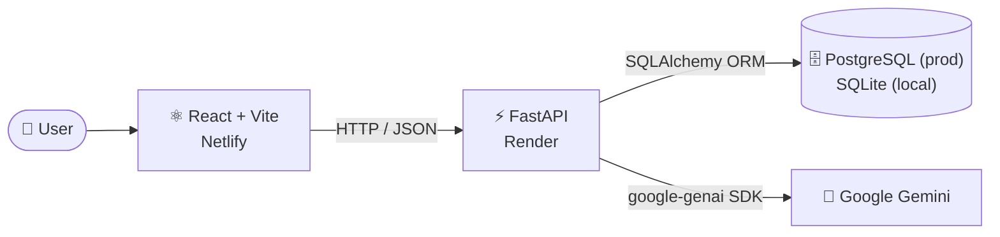
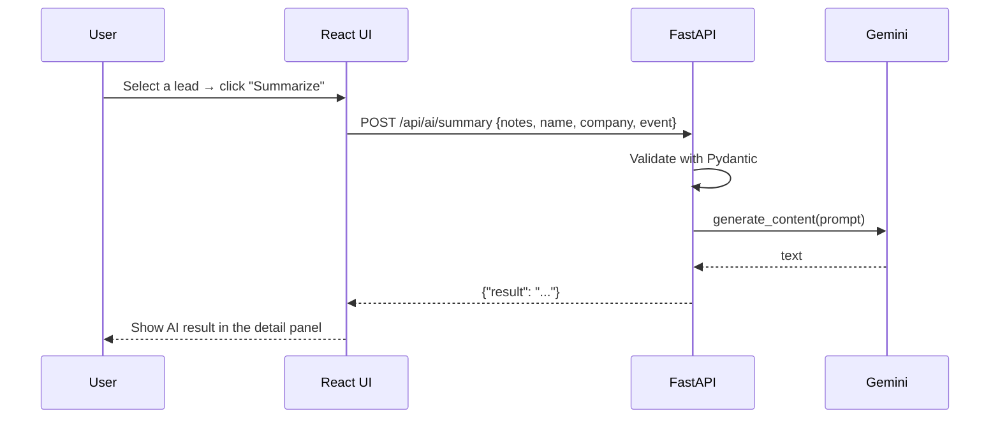
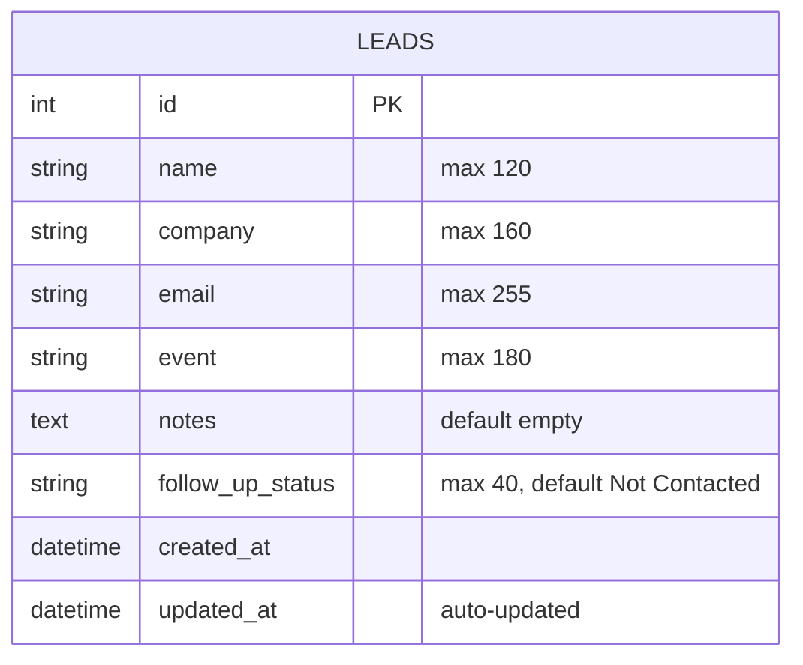
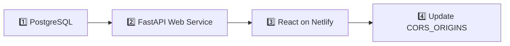

<div align="center">

# ✨ LeadFlow — AI Event Lead Manager

**Capture people you meet at business events, keep every conversation organized, and let AI turn your notes into the next action.**


[🌐 Live App](https://leadmanage04.netlify.app/) · [📖 API Docs](https://lead-manager-project-4y3r.onrender.com/docs) · [🚀 Quick Start](#-quick-start) · [🧠 Key Decisions](#-key-technical-decisions) · [🧪 Test It](#-try-it-in-2-minutes)

</div>

> Built for the **Even8 — AI Native Full Stack Intern** technical assignment: *"Build an AI Event Lead Manager."*

---

## 📑 Table of Contents

- [🔗 Live Links](#-live-links)
- [🎯 Assignment Requirements → Where to Find Them](#-assignment-requirements--where-to-find-them)
- [🧩 Features](#-features)
- [🏗️ Architecture](#️-architecture)
- [🧰 Tech Stack](#-tech-stack)
- [📂 Project Structure](#-project-structure)
- [🚀 Quick Start](#-quick-start)
- [⚙️ Environment Variables](#️-environment-variables)
- [🧪 Try It in 2 Minutes](#-try-it-in-2-minutes)
- [📡 API Reference](#-api-reference)
- [🗄️ Database Design](#️-database-design)
- [🤖 AI Integration](#-ai-integration)
- [☁️ Deployment (Render + Netlify)](#️-deployment-render--netlify)
- [🧠 Key Technical Decisions](#-key-technical-decisions)
- [🛠️ Troubleshooting](#️-troubleshooting)
- [⚠️ Known Limitations & Roadmap](#️-known-limitations--roadmap)
- [📬 Contact & Submission](#-contact--submission)

---

## 🔗 Live Links

| What | Link |
|---|---|
| 🌐 **Live application (frontend)** | https://leadmanage04.netlify.app/ |
| ⚙️ **Backend API** | https://lead-manager-project-4y3r.onrender.com |
| 📖 **Swagger / OpenAPI docs** | https://lead-manager-project-4y3r.onrender.com/docs |
| ❤️ **Health check** | https://lead-manager-project-4y3r.onrender.com/health |
| 💻 **GitHub repository** | https://github.com/omkargitcs/Lead_Manager_Project |


> 💤 **Heads-up:** On Render's free tier the backend sleeps when idle. The first request can take **30–60 seconds** to wake it up — please be patient, then everything is fast.

---

## 🎯 Assignment Requirements → Where to Find Them

| Requirement from the brief | Status | Where |
|---|:---:|---|
| Add leads | ✅ | `POST /api/leads` · **Add Lead** button |
| Edit leads | ✅ | `PUT /api/leads/{id}` · pencil icon / **Edit lead** |
| Delete leads | ✅ | `DELETE /api/leads/{id}` · trash icon (with confirm) |
| Search leads | ✅ | `?search=` — name, company, email, event, notes |
| Filter leads | ✅ | `?status=` and `?event=` dropdowns |
| Store name, company, email, event, notes, follow-up status | ✅ | `leads` table — see [Database Design](#️-database-design) |
| Save data in a database | ✅ | SQLite (local) / PostgreSQL (production) via SQLAlchemy |
| AI summary or follow-up draft | ✅ | **Summarize** and **Draft follow-up** buttons → Gemini |
| Clean, responsive UI | ✅ | React + Vite, card layout, detail side panel |
| Public repo + live link + README | ✅ | You're reading it |

---

## 🧩 Features

- ➕ **Full CRUD** — create, read, update and delete event leads
- 🔍 **Instant search** — debounced (250 ms) search across name, company, email, event and notes
- 🎛️ **Smart filters** — by follow-up status and by event (event list builds itself from your data)
- 📊 **Live stats** — total leads, leads in follow-up, converted leads
- 🧾 **Lead detail panel** — click any row to see full notes and run AI actions
- 🤖 **AI assistant** — summarize interaction notes or draft a follow-up message
- ✅ **Validation** — Pydantic validates emails, lengths and status values on the server; HTML5 `required` on the client
- 🛡️ **Friendly errors** — error banner in the UI, clear `503` when the AI key is missing, `502` when the AI provider fails
- 📖 **Auto-generated API docs** — interactive Swagger UI at `/docs`

**Follow-up statuses:** `Not Contacted` → `Contacted` → `Follow-up Sent` → `Converted`

---

## 🏗️ Architecture



**Request flow for an AI action**



---

## 🧰 Tech Stack

| Layer | Technology |
|---|---|
| **Frontend** | React, Vite, `lucide-react` icons, plain CSS |
| **Backend** | Python 3.13, FastAPI, Uvicorn, Pydantic v2 |
| **Database** | SQLAlchemy 2.0 ORM · SQLite (dev) · PostgreSQL via `psycopg` (prod) |
| **AI** | Google Gemini through the `google-genai` SDK |
| **Hosting** | Netlify (frontend) · Render (FastAPI web service + managed PostgreSQL) |

---

## 📂 Project Structure

```text
.
├── backend/
│   ├── app/
│   │   ├── main.py        # FastAPI app, CORS, all routes
│   │   ├── models.py      # SQLAlchemy Lead model
│   │   ├── schemas.py     # Pydantic request/response models + validation
│   │   ├── database.py    # Engine, session, DATABASE_URL normalisation
│   │   └── ai.py          # Gemini client + prompts
│   ├── .env.example
│   ├── .python-version
│   ├── pytest.ini
│   ├── requirements.txt
│   └── test_api.py
├── frontend/
│   ├── src/
│   │   ├── App.jsx        # UI: table, filters, modal, detail panel, AI panel
│   │   ├── api.js         # fetch wrapper + API functions
│   │   ├── main.jsx
│   │   └── styles.css
│   ├── .env.example
│   ├── index.html
│   └── package.json
├── render.yaml            # Render blueprint for the backend service
├── DEPLOYMENT-CHECKLIST.md
└── README.md
```

---

## 🚀 Quick Start

**Prerequisites:** Python 3.13+, Node.js 20+, Git, and a free [Gemini API key](https://aistudio.google.com/app/apikey) (only needed for the AI buttons — everything else works without it).

<details open>
<summary><b>🐍 Step 1 — Run the backend</b> (click to expand / collapse)</summary>

<br/>

**macOS / Linux**

```bash
cd backend
python3 -m venv .venv
source .venv/bin/activate
pip install -r requirements.txt
cp .env.example .env
uvicorn app.main:app --reload
```

**Windows (PowerShell)**

```powershell
cd backend
python -m venv .venv
.\.venv\Scripts\Activate.ps1
pip install -r requirements.txt
Copy-Item .env.example .env
uvicorn app.main:app --reload
```

Then open `backend/.env` and add your AI key:

```env
GEMINI_API_KEY=your_gemini_api_key_here
```

✅ API → http://localhost:8000  ·  Swagger → http://localhost:8000/docs

The SQLite file `event_leads.db` and the `leads` table are created automatically on first start.

</details>

<details open>
<summary><b>⚛️ Step 2 — Run the frontend</b> (in a second terminal)</summary>

<br/>

```bash
cd frontend
npm install
cp .env.example .env      # Windows: Copy-Item .env.example .env
npm run dev
```

✅ App → http://localhost:5173

</details>

<details>
<summary><b>🔁 Useful commands</b></summary>

<br/>

| Task | Command |
|---|---|
| Backend with auto-reload | `uvicorn app.main:app --reload` |
| Backend syntax check | `python -m compileall -q backend/app` |
| Frontend production build | `npm run build` (from `frontend/`) |
| Preview production build | `npm run preview` (from `frontend/`) |
| Reset local database | delete `backend/event_leads.db` and restart the server |

</details>

---

## ⚙️ Environment Variables

<details>
<summary><b>Backend</b> — <code>backend/.env</code></summary>

<br/>

| Variable | Required | Default | Description |
|---|:---:|---|---|
| `DATABASE_URL` | No | `sqlite:///./event_leads.db` | SQLite locally; PostgreSQL URL in production. `postgres://` and `postgresql://` are auto-converted to `postgresql+psycopg://`. |
| `GEMINI_API_KEY` | For AI | — | Google Gemini API key. Without it, AI endpoints return `503` and the rest of the app works normally. |
| `GEMINI_MODEL` | No | `gemini-3-flash-preview` | Gemini model name used for generation. |
| `CORS_ORIGINS` | No | `http://localhost:5173` | Comma-separated list of allowed frontend origins. |

</details>

<details>
<summary><b>Frontend</b> — <code>frontend/.env</code></summary>

<br/>

| Variable | Required | Default | Description |
|---|:---:|---|---|
| `VITE_API_URL` | No | `http://localhost:8000` (from `.env.example`) | Base URL of the FastAPI backend. Trailing slash is stripped. |

> ⚠️ If `VITE_API_URL` is not set at all, `api.js` falls back to the deployed Render backend.

</details>

> 🔐 Never commit `.env` files or API keys. They are already excluded by `.gitignore` (only `.env.example` is tracked).

---

## 🧪 Try It in 2 Minutes

A guided tour — tick the boxes as you go:

- [ ] **1. Create** — click **Add Lead**, fill in *Name, Company, Email, Event* and some notes, then **Create lead**
- [ ] **2. Persist** — refresh the page; your lead is still there (it's in the database)
- [ ] **3. Edit** — click the ✏️ icon, change the status to `Contacted`, save
- [ ] **4. Search** — type part of a company or note text in the search bar
- [ ] **5. Filter** — use the status and event dropdowns
- [ ] **6. Inspect** — click a row to open the detail panel
- [ ] **7. Summarize** — click **Summarize** and read the AI summary
- [ ] **8. Follow-up** — click **Draft follow-up**
- [ ] **9. Delete** — click 🗑️ and confirm
- [ ] **10. Explore the API** — open [`/docs`](https://lead-manager-project-4y3r.onrender.com/docs) and click **Try it out**

<details>
<summary><b>📋 Sample lead to paste in</b></summary>

<br/>

| Field | Value |
|---|---|
| Name | Priya Sharma |
| Company | Acme Analytics |
| Email | priya@acme-analytics.com |
| Event | SaaS Summit 2026 |
| Status | Not Contacted |
| Notes | Met at the demo booth. Interested in measuring event ROI for their B2B team. Asked about CRM integration and pricing. Wants a follow-up next week with a case study. |

</details>

---

## 📡 API Reference

Base URL: `http://localhost:8000` (local) · `https://lead-manager-project-4y3r.onrender.com` (live)

| Method | Endpoint | Description | Success |
|:---:|---|---|:---:|
| `GET` | `/` | API info | `200` |
| `GET` | `/health` | Health check | `200` |
| `GET` | `/api/leads` | List leads (supports `search`, `status`, `event`) | `200` |
| `GET` | `/api/leads/{id}` | Get one lead | `200` |
| `POST` | `/api/leads` | Create a lead | `201` |
| `PUT` | `/api/leads/{id}` | Update a lead (full replace of editable fields) | `200` |
| `DELETE` | `/api/leads/{id}` | Delete a lead | `204` |
| `POST` | `/api/ai/summary` | AI: summarize interaction notes | `200` |
| `POST` | `/api/ai/follow-up` | AI: follow-up message | `200` |

Lists are sorted by **most recently updated** first. Passing `status=All` or `event=All` disables that filter.

<details>
<summary><b>📥 Request / response examples</b></summary>

<br/>

**Create a lead**

```bash
curl -X POST http://localhost:8000/api/leads \
  -H "Content-Type: application/json" \
  -d '{
    "name": "Priya Sharma",
    "company": "Acme Analytics",
    "email": "priya@acme-analytics.com",
    "event": "SaaS Summit 2026",
    "notes": "Interested in event ROI measurement. Wants a case study.",
    "follow_up_status": "Not Contacted"
  }'
```

```json
{
  "id": 1,
  "name": "Priya Sharma",
  "company": "Acme Analytics",
  "email": "priya@acme-analytics.com",
  "event": "SaaS Summit 2026",
  "notes": "Interested in event ROI measurement. Wants a case study.",
  "follow_up_status": "Not Contacted",
  "created_at": "2026-10-06T03:10:00.000000",
  "updated_at": "2026-10-06T03:10:00.000000"
}
```

**Search + filter**

```bash
curl "http://localhost:8000/api/leads?search=acme&status=Contacted&event=SaaS%20Summit%202026"
```

**AI summary**

```bash
curl -X POST http://localhost:8000/api/ai/summary \
  -H "Content-Type: application/json" \
  -d '{
    "notes": "Met at booth. Wants pricing and CRM integration details.",
    "name": "Priya Sharma",
    "company": "Acme Analytics",
    "event": "SaaS Summit 2026"
  }'
```

```json
{ "result": "Priya from Acme Analytics asked about pricing and CRM integration at the booth." }
```

</details>

<details>
<summary><b>🚦 Validation rules & error codes</b></summary>

<br/>

| Field | Rule |
|---|---|
| `name` | 1–120 characters |
| `company` | 1–160 characters |
| `email` | valid email address |
| `event` | 1–180 characters |
| `notes` | up to 5000 characters (optional) |
| `follow_up_status` | one of `Not Contacted`, `Contacted`, `Follow-up Sent`, `Converted` |

| Code | Meaning |
|:---:|---|
| `404` | Lead not found |
| `422` | Validation error (bad email, missing field, invalid status…) |
| `502` | The AI provider request failed |
| `503` | AI is not configured (missing `GEMINI_API_KEY`) |

</details>

---

## 🗄️ Database Design



- Single table, deliberately simple — the assignment is about one entity.
- `updated_at` refreshes automatically on every update, so the newest-touched lead is always on top.
- Tables are created on startup with `Base.metadata.create_all()` — no manual migration step for this scope.

---

## 🤖 AI Integration

- **Provider:** Google Gemini via the official `google-genai` SDK (`backend/app/ai.py`).
- **Two actions in the UI:** **Summarize** (`/api/ai/summary`) and **Draft follow-up** (`/api/ai/follow-up`).
- **Context sent to the model:** the lead's notes, name, company and event.
- **Grounding:** prompts explicitly instruct the model *not to invent information that isn't in the notes*.
- **Lazy client:** the SDK client is created only on first use, so the app boots and CRUD works even with no API key.
- **Graceful failures:** missing key → `503` with a clear message; provider error → `502`.

<details>
<summary><b>💬 Prompt design</b></summary>

<br/>

`ai.py` defines two dedicated prompts (see [Known Limitations](#️-known-limitations--roadmap) for the current wiring of the follow-up one):

- **Summary:** *"Summarize the following event lead interaction notes in 2–4 professional and concise sentences… Do not invent information."*
- **Follow-up:** *"Draft a short, polite follow-up message… mention the previous interaction, suggest a reasonable next step, be concise, do not invent information."*

</details>

---

## ☁️ Deployment (Render + Netlify)



<details>
<summary><b>1️⃣ Database — Render PostgreSQL</b></summary>

<br/>

1. Render dashboard → **New → PostgreSQL**
2. Name it (e.g. `even8-leads-db`) and create it
3. Copy the **Internal Connection String**

</details>

<details>
<summary><b>2️⃣ Backend — Render Web Service</b></summary>

<br/>

| Setting | Value |
|---|---|
| Repository | your GitHub repo |
| Root directory | `backend` |
| Runtime | Python |
| Build command | `pip install -r requirements.txt` |
| Start command | `uvicorn app.main:app --host 0.0.0.0 --port $PORT` |

Environment variables:

```text
DATABASE_URL=<Render PostgreSQL internal connection string>
GEMINI_API_KEY=<your Gemini API key>
GEMINI_MODEL=gemini-3-flash-preview
CORS_ORIGINS=<frontend URL — see step 4>
```

Verify: `https://lead-manager-project-4y3r.onrender.com/health` → `{"status":"ok"}` and `/docs` loads.

> A `render.yaml` blueprint for the backend is included in the repo.

</details>

<details>
<summary><b>3️⃣ Frontend — Netlify</b></summary>

<br/>

| Setting | Value |
|---|---|
| Base directory | `frontend` |
| Build command | `npm install && npm run build` |
| Publish directory | `frontend/dist` |

Environment variable:

```text
VITE_API_URL=https://lead-manager-project-4y3r.onrender.com
```

Set it in Netlify under **Site configuration → Environment variables** *before* building, then trigger a redeploy.

</details>

<details>
<summary><b>4️⃣ Final CORS update</b></summary>

<br/>

Once the frontend has its final URL, set this on the backend service and redeploy:

```text
CORS_ORIGINS=https://leadmanage04.netlify.app
```

Then run through the [2-minute tour](#-try-it-in-2-minutes) on the [live site](https://leadmanage04.netlify.app/).

</details>

See also: [`DEPLOYMENT-CHECKLIST.md`](DEPLOYMENT-CHECKLIST.md).

---

## 🧠 Key Technical Decisions

<details open>
<summary><b>Why React + Vite?</b></summary>

Fast dev server, tiny config and a simple static build — ideal for a focused single-page UI that deploys to Netlify as static files with no server runtime.

</details>

<details open>
<summary><b>Why FastAPI?</b></summary>

Automatic request validation through Pydantic, typed responses, and free interactive Swagger docs at `/docs` — which makes the API easy for reviewers to test without the frontend.

</details>

<details open>
<summary><b>Why SQLite locally and PostgreSQL in production?</b></summary>

SQLite means zero setup for anyone cloning the repo. PostgreSQL is the right shared, durable database for a deployed app and is a managed service on Render. SQLAlchemy keeps the code identical for both — only `DATABASE_URL` changes (and `postgres://` URLs are normalised automatically).

</details>

<details open>
<summary><b>Why Gemini for AI?</b></summary>

The brief asks for a *practical* AI feature. Gemini offers a generous free tier, which keeps the project free to run and easy for reviewers to try. The scope stays deliberately small — summarize notes and draft a follow-up — and the lazy-loaded client means AI being unavailable never breaks the core app.

</details>

<details open>
<summary><b>Why a single <code>leads</code> table and no authentication?</b></summary>

The assignment specifies one entity and recommends 4–6 hours of effort. I chose to spend time on a polished CRUD + search/filter + AI flow rather than on auth infrastructure. Multi-user accounts are listed on the roadmap.

</details>

<details>
<summary><b>Why server-side search and filtering?</b></summary>

Filtering in the database (`ILIKE` for search, equality for status/event) keeps the API correct as data grows, instead of sending every lead to the browser. The UI debounces input by 250 ms to avoid a request per keystroke.

</details>

<details>
<summary><b>Why AI-assisted development?</b></summary>

This project was built using AI-assisted tools for speed, with every decision reviewed, tested and understood by me. *(Edit this note to describe your own workflow.)*

</details>

---

## 🛠️ Troubleshooting

<details>
<summary><b>The first request is very slow / times out</b></summary>

<br/>Render free-tier services sleep when idle. Wait up to a minute, then retry. Opening `/health` first is a handy way to wake the backend.

</details>

<details>
<summary><b>Browser console shows a CORS error</b></summary>

<br/>Make sure `CORS_ORIGINS` on the backend exactly matches your frontend origin (scheme + host, **no trailing slash**), then redeploy the backend. Multiple origins are comma-separated.

</details>

<details>
<summary><b>AI buttons show "GEMINI_API_KEY is not configured"</b></summary>

<br/>Add `GEMINI_API_KEY` to `backend/.env` (local) or to the Render environment variables (production) and restart the backend.

</details>

<details>
<summary><b>"AI request failed: …" (502)</b></summary>

<br/>The key is set but Gemini rejected or failed the call. Check the key is valid, you have quota, and that `GEMINI_MODEL` is a model available to your account.

</details>

<details>
<summary><b>Frontend talks to the wrong backend</b></summary>

<br/>Set `VITE_API_URL` in `frontend/.env` and restart `npm run dev`. For deployed builds, set it in Netlify **before** building — Vite bakes it in at build time.

</details>

<details>
<summary><b>I want a clean local database</b></summary>

<br/>Stop the server, delete `backend/event_leads.db`, start it again.

</details>

---

## ⚠️ Known Limitations & Roadmap

**Current limitations** *(honest scope notes)*

- No authentication or multi-user separation — all leads are shared.
- No automated test suite yet; `backend/test_api.py` is a manual testing guide. The API can be exercised through `/docs`.
- No database migrations (tables are created on startup).
- No pagination on the leads list.
- AI output is shown for copying/editing but is not saved on the lead.
- `/api/ai/follow-up` currently passes through the same `generate_ai_text()` helper as the summary endpoint, so it returns a summary-style response. The dedicated `draft_follow_up()` prompt exists in `ai.py` but is not yet wired to the endpoint.
- `.env.example`, `render.yaml` and `requirements.txt` still contain leftover OpenAI entries from an earlier iteration; the running code uses **Gemini** only.

**Roadmap ideas**

- [ ] Authentication and per-user leads
- [ ] Pytest suite with an in-memory SQLite database
- [ ] Alembic migrations
- [ ] Pagination and sorting controls
- [ ] Save AI summaries / drafts on the lead
- [ ] CSV import / export
- [ ] "Send via email" integration for f

| | |
|---|---|
| **Email** | [pn@even8.io](mailto:pn@even8.io) |
| **Subject** | `Full Stack Assignment <Your Name>` |
| **Repository** | https://github.com/omkargitcs/Lead_Manager_Project |
| **Live app** | https://leadmanage04.netlify.app/ |

---

<div align="center">


</div>
